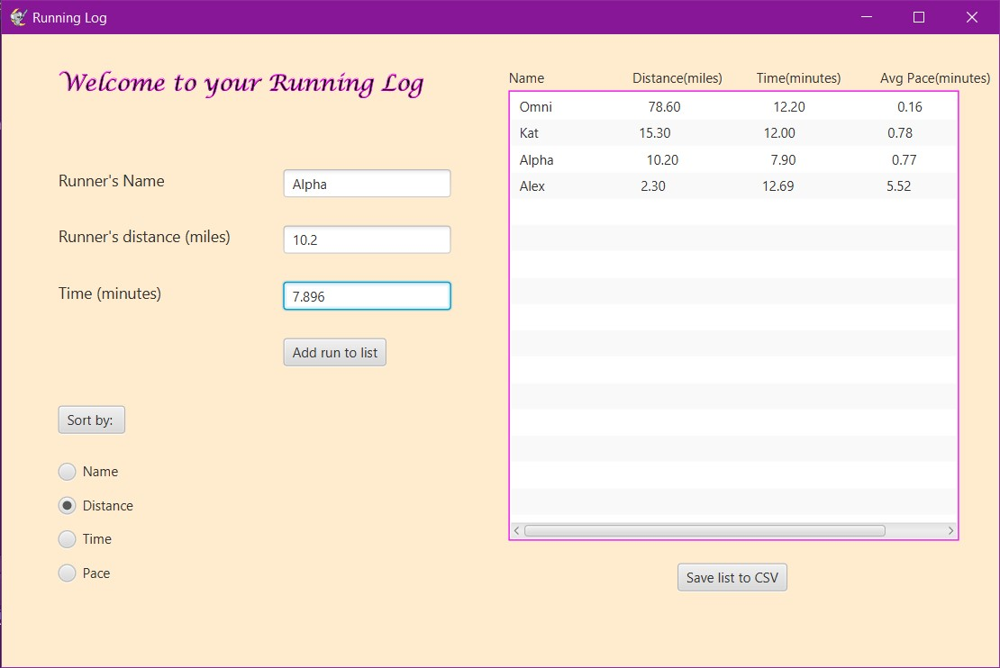

# RunningLog
Running Log GUI that stores/sorts input data from the user using name/distance/time and calculates pace with a button that saves current list into a CSV file

An example of the list sorted by distance

